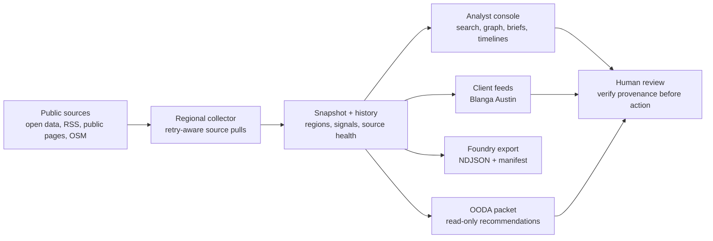
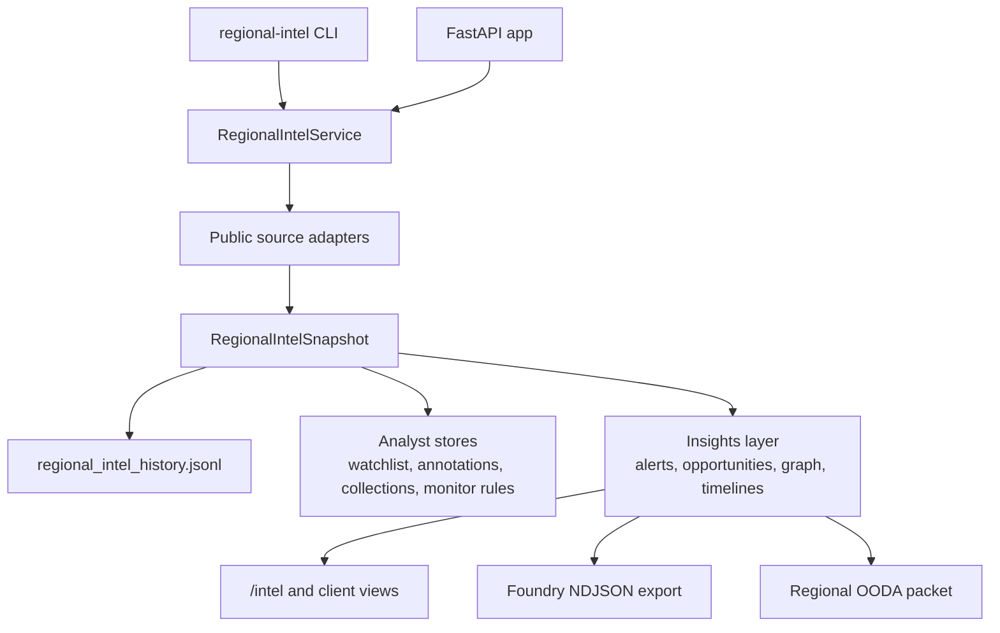

<div align="center">


# Regional Intelligence Workbench

**A public-source regional intelligence console for local markets, client feeds, and provenance-ready decision packets.**

[](pyproject.toml)
[](app/main.py)
[](tests)
[](scripts/ui_smoke.py)
[](#ethics-and-provenance)
[](app/services/foundry_export.py)
[](LICENSE)

</div>

Regional Intelligence Workbench turns public regional signals into a practical analyst surface: permits, local news, open business data, source health, entity timelines, client-specific feeds, and read-only OODA packets. It is designed for high-context local-market research where every surfaced item needs provenance a human can inspect before acting.

The current workspace covers **Austin**, **Houston**, and **Gunnison / Crested Butte Valley**. Its first polished client feed is the **Blanga Austin STNL + Redevelopment Feed** at `/blanga/austin`; the legacy `ve-vote-monitor` dashboard remains available at `/vote-monitor` for compatibility.

> Showcase posture: this repo is presented as a **local-first demo and analyst workbench**. The screenshots, CLI, FastAPI app, and committed sample history are demoable from a laptop; this README does not claim a hosted production deployment.

## Demo Preview

<p align="center">
  
</p>

<p align="center">
  
</p>

## Current Snapshot

The committed public-source snapshot was refreshed on **2026-04-29 at 05:44 UTC** after repairing Austin's moved Small Business Division URL and compacting malformed legacy history records.

| Metric | Current value |
| --- | ---: |
| Regions | 3 |
| News items | 7 |
| Permit items | 120 |
| Public business leads | 240 |
| Public professional contacts | 7 |
| Organization profiles | 180 |
| Source-health rows | 20 |

## At a Glance

| Surface | What it does |
| --- | --- |
| `/intel` | Shared analyst console for search, graph exploration, opportunities, briefs, monitor rules, watchlists, annotations, collections, and source diagnostics. |
| `/blanga/austin` | Curated Austin brokerage feed for single-tenant retail, redevelopment, vacancy, commercial permit, and operator lead signals. |
| `/api/intel/*` | JSON endpoints for health, snapshots, recent signals, graph data, alerts, OODA packets, briefings, trends, source history, and analyst stores. |
| `regional-intel` | CLI for refreshes, search, opportunity ranking, briefing packs, Foundry export, and read-only OODA packets. |
| Foundry export | Local NDJSON export with row hashes, file hashes, source-health summary, and provenance drop reporting. |

## What To Show First

| Moment | Proof point |
| --- | --- |
| Shared console | `/intel` shows one regional intelligence model with search, source diagnostics, graph context, watchlists, collections, and briefing flows. |
| Client view | `/blanga/austin` shows how the same graph becomes a polished, audience-specific workflow without forking the collector. |
| API surface | `/api/client-views/blanga_austin` and `/api/intel/recent?region=austin_tx` expose the same intelligence as JSON for external tools. |
| Provenance | Source names, source URLs, source-health rows, and history records are kept close to the surfaced signal. |
| Safety boundary | OODA packets are read-only recommendations from stored snapshots; they do not refresh sources or write to external systems. |

## Local Demo Path

For a quick demo, start the app locally, open `/intel` to show the shared regional console, then open `/blanga/austin` to show how the same graph becomes a polished client workflow. The strongest talking points are public-source guardrails, source-level provenance, the Austin redevelopment feed, and the read-only OODA packet path.

```bash
regional-intel serve --port 8768
regional-intel intel-ooda-packet --region austin_tx --json
```

See [`docs/SHOWCASE.md`](docs/SHOWCASE.md) for a tighter demo script,
CLI snippets, screenshot policy, and provenance guardrails.

## Intelligence Loop



## Product Surfaces

### Intelligence Console

The shared analyst workspace at `/intel` supports cross-entity search across news, permits, businesses, contacts, and organizations. It also includes relationship graph exploration, opportunity scoring, regional briefs, entity timelines, source history, incident tracking, monitor rules, saved watchlists, analyst annotations, collections, and multi-collection briefing bundles.

### Client-Specific Feeds

Client feeds are curated views on top of the shared intelligence graph. The current feed is:

| Feed | Audience | Focus |
| --- | --- | --- |
| `/blanga/austin` | Single-tenant retail and redevelopment brokerage in the Austin MSA | Deal radar, vacancy and closure signals, retail construction, tenant-improvement activity, redevelopment watch, operator discovery, public contact paths, and recent change tracking. |

### Legacy Vote Monitor

The original vote-monitor surface remains available at `/vote-monitor` and is still served by the same FastAPI app. Active development is now centered on the regional intelligence platform.

## Regional Coverage

| Region | Live / adapted coverage | Current limits |
| --- | --- | --- |
| Austin, Texas | Austin Open Data permits, Hays County public permits, Williamson County public permits, Google News RSS filtering, OpenStreetMap / Overpass, Austin public economic-development contacts. | Subscription business outlets remain manual-reference only. |
| Houston, Texas | Houston public planning development spreadsheets, Houston-area public news signals, OpenStreetMap / Overpass, public economic-development and innovation contacts. | The generic Houston permitting portal is cataloged, but live extraction is limited to anonymous public planning artifacts. |
| Gunnison / Crested Butte Valley, Colorado | Public local news signals, official Gunnison County and Town of Crested Butte pages, OpenStreetMap / Overpass, public community-development contacts. | Live permit extraction still needs a stable anonymous public adapter. |

## Ethics and Provenance

This product is intentionally constrained:

- Public-source collection only.
- No login-gated scraping.
- No paywall bypass.
- No private-person dossiering.
- Public professional and business contacts only.
- Source name and source URL retained for surfaced signals.
- Source-health and source-history views make stale or failing sources visible instead of hiding them.
- Foundry export reports provenance drops rather than silently promoting incomplete rows.
- OODA packets are read-only and do not perform external refreshes or external writes.
- Humans verify provenance before any outreach, transaction, publication, or operational action.

The intent is to support disciplined regional research, not automated targeting. The workbench should make a reviewer faster at asking the right follow-up questions while keeping source context visible.

## Architecture



Key modules:

| Path | Role |
| --- | --- |
| `app/main.py` | FastAPI routes, HTML surfaces, and JSON API endpoints. |
| `app/services/regional_intel.py` | Region profiles, public source catalog, collection logic, ethics rules, and snapshots. |
| `app/services/client_views.py` | Curated client-feed composition, currently Blanga Austin. |
| `app/services/intel_insights.py` | Graph, opportunities, alerts, changes, timelines, briefings, and monitor evaluations. |
| `app/services/foundry_export.py` | Foundry-ready NDJSON export and manifest generation. |
| `app/services/regional_ooda.py` | Read-only regional OODA packet generation from stored snapshots. |

Design principles:

- **Local demo first:** the reliable path is `regional-intel serve --port 8768` plus committed screenshots and local JSON endpoints.
- **Shared graph, tailored views:** client feeds are composed from the shared regional snapshot instead of becoming one-off scrapers.
- **Provenance near the signal:** source name, URL, source health, item IDs, history, and deep links stay visible across UI, API, CLI, and export paths.
- **Read-only recommendations:** analysis packets can suggest safe next steps, but they do not execute outreach, trades, writes, or refreshes.
- **Graceful source failure:** source-health rows and incident views are part of the product surface, so a demo can explain what is fresh, degraded, or manual-reference only.

## Quick Start

```bash
cd /Users/aribs/Code/regional-intel-workbench
python -m venv .venv
source .venv/bin/activate
pip install -e .
python -m playwright install chromium
uvicorn app.main:app --reload --port 8768
```

Open:

- [http://127.0.0.1:8768](http://127.0.0.1:8768)
- [http://127.0.0.1:8768/intel](http://127.0.0.1:8768/intel)
- [http://127.0.0.1:8768/blanga/austin](http://127.0.0.1:8768/blanga/austin)
- [http://127.0.0.1:8768/vote-monitor](http://127.0.0.1:8768/vote-monitor)

## CLI

Primary CLI:

```bash
regional-intel --help
```

Compatibility alias:

```bash
ve-vote-monitor --help
```

Useful commands:

```bash
regional-intel intel-collect --force
regional-intel intel-snapshot --region austin_tx
regional-intel intel-search "Amy's Ice Creams" --region austin_tx
regional-intel intel-opportunities --region houston_tx
regional-intel intel-alerts --region austin_tx
regional-intel intel-region-briefing --region austin_tx
regional-intel intel-briefing <item_id>
regional-intel intel-monitor-rules --region austin_tx
regional-intel intel-foundry-export --region austin_tx --output-dir data/foundry/regional-intel
regional-intel intel-ooda-packet --region austin_tx --json
regional-intel serve --port 8768
```

`intel-foundry-export` writes local Foundry-ready NDJSON files for `Region`, `IntelItem`, and `IntelSourceHealth` from the latest stored snapshot by default. The manifest includes row hashes, file hashes, provenance drop counts, and a source-health summary. Add `--refresh` only when you want to refresh public sources before exporting.

`intel-ooda-packet` is read-only. It uses the latest stored regional snapshot, performs no external refresh, performs no Foundry/GCS/BQ writes, and returns safe act recommendations only.

## API Highlights

Read-mostly demo endpoints:

```text
GET /api/intel/health
GET /api/intel/regions
GET /api/intel/sources
GET /api/intel/snapshot
GET /api/intel/recent
GET /api/intel/search
GET /api/intel/graph
GET /api/intel/opportunities
GET /api/intel/alerts
GET /api/intel/briefs
GET /api/intel/region-briefing/{region_id}
GET /api/intel/briefing/{item_id}
GET /api/intel/items/{kind}/{item_id}
GET /api/intel/timeline/{item_id}
GET /api/intel/ooda-packet
```

Source and change diagnostics:

```text
GET /api/intel/source-health
GET /api/intel/source-history
GET /api/intel/source-incidents
GET /api/intel/trends
GET /api/intel/region-changes
GET /api/intel/entity-changes
```

Client and analyst workflow views:

```text
GET /api/client-views
GET /api/client-views/{view_id}
GET /api/intel/watchlist
GET /api/intel/watchlist-items
GET /api/intel/collections
GET /api/intel/bundles
GET /api/intel/monitor-rules
GET /client-views/{view_id}
```

`/api/intel/recent?limit=10&region=austin_tx` returns a compact feed for external dashboards, including item identity, kind, region, title, timestamp, severity, score, source provenance, tags, and a deep link back into `/intel`.

`/api/client-views/blanga_austin` returns the curated Austin client feed as JSON, including metrics, feed sections, item scores, public source URLs, recommended human-review actions, and deep links back into the shared console.

## Friend-Demo Checklist

Before showing the repo to a friend, buyer, or collaborator:

- Start locally with `regional-intel serve --port 8768`.
- Open `/intel`, `/blanga/austin`, and `/api/client-views/blanga_austin` in three tabs.
- Use the committed screenshots in `docs/assets/` if the room is noisy, offline, or short on time.
- Say plainly that this is a local-first demo, not a hosted deployment claim.
- Point out source URLs, source health, and the public-source-only guardrails before discussing recommendations.
- Show one CLI read path, such as `regional-intel intel-ooda-packet --region austin_tx --json`.
- Avoid live external refreshes during the demo unless the audience specifically wants to discuss source adapters.
- Do not add private customer data, secrets, login-gated sources, or real outreach actions to make the demo look richer.

## Validation

API regression:

```bash
uv run --python 3.11 python -m unittest discover -s tests -v
```

Headless UI smoke:

```bash
python scripts/ui_smoke.py
```

The dependable validation path is local. The UI smoke covers `/blanga/austin` on desktop and mobile, `/intel?region=austin_tx` on desktop, map presence, key metric rendering, and horizontal overflow regressions.

## Repository Layout

```text
app/        FastAPI app, templates, static frontend, services, and presenters
data/       Local snapshot history and runtime analyst stores
deploy/     Legacy/local deployment assets
scripts/    UI smoke and utility scripts
tests/      API, export, resilience, and workflow-gate regression tests
```

## Roadmap

- Scheduled refresh and notification workflow for monitor-rule matches.
- Stronger permit/news address enrichment for client feeds.
- Additional client-specific views beyond Blanga Austin.
- A stable anonymous public adapter for Gunnison / Crested Butte permit activity.
- Eventual repo extraction / rename once the intelligence platform fully outgrows the legacy vote-monitor identity.

## License

Apache-2.0. See [LICENSE](LICENSE).
