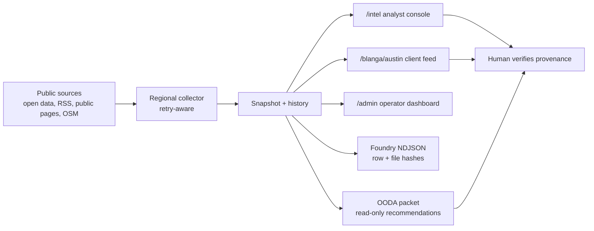

<div align="center">


# Regional Intelligence Workbench

</div>

[](pyproject.toml)
[](app/main.py)
[](tests)
[](#ethics-and-provenance)
[](app/services/foundry_export.py)
[](https://regional.sapphirealpha.xyz/admin)
[](LICENSE)

**A public-source regional intelligence console with provenance you can inspect before acting.**
Permits, local news, public business data, source-health diagnostics, entity timelines, and read-only OODA packets — all anchored to source URLs a human can verify.
Palantir Foundry costs millions and gates access; this exports Foundry-ready NDJSON from public data, runs on a laptop, and refuses to lie about source health.

---

## Live

| Surface | URL |
|---|---|
| Admin frontend | <https://regional.sapphirealpha.xyz/admin> |
| Health | <https://regional.sapphirealpha.xyz/healthz/> |
| Local console | `/intel` (start with `regional-intel serve --port 8768`) |
| Local client feed | `/blanga/austin` (curated brokerage view) |
| Local API | `/api/intel/*`, `/api/client-views/*` |

Coverage today: **Austin, TX** · **Houston, TX** · **Gunnison / Crested Butte Valley, CO**.

## What sets this apart

| | This | Palantir Foundry | Hunter / Apollo / ZoomInfo | Notion + RSS |
|---|---|---|---|---|
| **Cost** | $0 (public sources) | seven figures | per-seat SaaS | per-seat SaaS |
| **Public-source-only guardrail** | enforced in code | no | no | n/a |
| **Source-health visibility** | first-class panel + history | analyst-side | hidden | none |
| **Login-gated scraping** | refused | n/a | yes | n/a |
| **Foundry-ready export** | NDJSON with row hashes + manifest | native | no | no |
| **Read-only OODA recommendations** | yes (no external writes) | yes | n/a | n/a |
| **Local-first demo path** | yes (`regional-intel serve`) | no | no | no |

The differentiator is **provenance discipline**. Every signal carries source name, source URL, source-health row, and history — surfaced where the analyst is reading, not buried in a debug page. Stale and failing sources are visible, not hidden.

## Quickstart (5 minutes)

Python 3.11+. macOS or Linux.

```bash
# 1. Install
pip install -e .
python -m playwright install chromium       # for ui_smoke + analyst console

# 2. Serve
uvicorn app.main:app --reload --port 8768

# 3. Open three tabs
#   /intel             → shared analyst console
#   /blanga/austin     → curated client feed
#   /admin             → operator dashboard (Leaflet map + source health)

# 4. Read-only OODA packet from the latest stored snapshot
regional-intel intel-ooda-packet --region austin_tx --json

# 5. Export to Foundry-ready NDJSON
regional-intel intel-foundry-export --region austin_tx \
    --output-dir data/foundry/regional-intel
```

`uv` users:
```bash
uv run --no-project --python 3.11 --with-editable . regional-intel serve --port 8768
```

## Architecture



| Module | Role |
|---|---|
| `app/main.py` | FastAPI routes, HTML surfaces, JSON endpoints |
| `app/services/regional_intel.py` | Region profiles, source catalog, ethics rules, snapshots |
| `app/services/client_views.py` | Curated client feed composition (Blanga Austin) |
| `app/services/intel_insights.py` | Graph, opportunities, alerts, timelines, briefings |
| `app/services/foundry_export.py` | Foundry-ready NDJSON + manifest |
| `app/services/regional_ooda.py` | Read-only regional OODA packet generation |

## Surfaces

### `/intel` — analyst console
Cross-entity search across news, permits, businesses, contacts, organizations. Relationship graph, opportunity scoring, regional briefs, entity timelines, source history, incidents, monitor rules, watchlists, annotations, collections, briefing bundles.

### `/blanga/austin` — client feed
Curated view of the shared graph for an Austin single-tenant retail + redevelopment brokerage. Deal radar, vacancy / closure signals, retail construction, tenant-improvement activity, redevelopment watch, operator discovery, public contact paths.

### `/admin` — operator dashboard
Region selector, Leaflet dark-CARTO map with bounding boxes, latest intel feed grouped by category, source-health panel with 14d history, trends sparklines, search, monitor-rules list, "how to interpret" modal. Auth gate via `X-Admin-Token` (env `ADMIN_TOKEN`); WebAuthn migration planned. Health at `/healthz/` returns `Cache-Control: no-store`.

### Legacy `/vote-monitor`
Original surface preserved for compatibility. Active development is on the regional intelligence platform.

## Coverage

| Region | Live coverage | Limits |
|---|---|---|
| Austin, TX | Open Data permits, Hays + Williamson public permits, Google News RSS, OSM/Overpass, public econ-dev contacts | Subscription outlets are manual-reference only |
| Houston, TX | Houston public planning spreadsheets, public news, OSM/Overpass, public econ-dev + innovation contacts | Generic permitting portal cataloged; live extraction is anonymous-only |
| Gunnison / Crested Butte, CO | Public local news, official Gunnison County + Town of CB pages, OSM/Overpass, community-dev contacts | Live permit extraction needs a stable anonymous adapter |

## Ethics and provenance

This product is intentionally constrained:
- Public-source collection only · no login-gated scraping · no paywall bypass.
- No private-person dossiering. Public professional and business contacts only.
- Source name + URL retained on every surfaced signal.
- Source-health and history make stale or failing sources visible.
- Foundry export reports provenance drops rather than silently promoting incomplete rows.
- OODA packets are read-only and perform no external refresh or writes.
- Humans verify provenance before any outreach, transaction, publication, or operational action.

## API highlights

```text
GET /api/intel/health           GET /api/intel/recent
GET /api/intel/snapshot         GET /api/intel/search
GET /api/intel/graph            GET /api/intel/opportunities
GET /api/intel/alerts           GET /api/intel/briefs
GET /api/intel/region-briefing/{region_id}
GET /api/intel/timeline/{item_id}
GET /api/intel/ooda-packet
GET /api/intel/source-health    GET /api/intel/source-history
GET /api/client-views           GET /api/client-views/{view_id}
```

`/api/client-views/blanga_austin` returns the full curated feed as JSON — metrics, sections, item scores, public source URLs, recommended human-review actions, deep links back into the console.

## CLI

```bash
regional-intel intel-collect --force
regional-intel intel-snapshot --region austin_tx
regional-intel intel-search "Amy's Ice Creams" --region austin_tx
regional-intel intel-opportunities --region houston_tx
regional-intel intel-alerts --region austin_tx
regional-intel intel-region-briefing --region austin_tx
regional-intel intel-foundry-export --region austin_tx --output-dir data/foundry/regional-intel
regional-intel intel-ooda-packet --region austin_tx --json
regional-intel serve --port 8768
```

`intel-foundry-export` writes local Foundry-ready NDJSON files for `Region`, `IntelItem`, and `IntelSourceHealth` from the latest stored snapshot by default. The manifest includes row hashes, file hashes, provenance drop counts, and a source-health summary. Add `--refresh` only when you want to refresh public sources before exporting.

`intel-ooda-packet` is read-only. It uses the latest stored regional snapshot, performs no external refresh, performs no Foundry/GCS/BQ writes, and returns safe act recommendations only.

## API Highlights

Interactive API documentation is available when the app is running:

- **Swagger UI:** `/docs`
- **ReDoc:** `/redoc`

Read-mostly demo endpoints:

```text
GET /api/intel/health
GET /api/intel/regions
GET /api/intel/sources
GET /api/intel/snapshot
GET /api/intel/recent
GET /api/intel/search
GET /api/intel/graph
GET /api/intel/opportunities
GET /api/intel/alerts
GET /api/intel/briefs
GET /api/intel/region-briefing/{region_id}
GET /api/intel/briefing/{item_id}
GET /api/intel/items/{kind}/{item_id}
GET /api/intel/timeline/{item_id}
GET /api/intel/ooda-packet
```

Source and change diagnostics:

```text
GET /api/intel/source-health
GET /api/intel/source-history
GET /api/intel/source-incidents
GET /api/intel/trends
GET /api/intel/region-changes
GET /api/intel/entity-changes
```

Client and analyst workflow views:

```text
GET /api/client-views
GET /api/client-views/{view_id}
GET /api/intel/watchlist
GET /api/intel/watchlist-items
GET /api/intel/collections
GET /api/intel/bundles
GET /api/intel/monitor-rules
GET /client-views/{view_id}
```

`/api/intel/recent?limit=10&region=austin_tx` returns a compact feed for external dashboards, including item identity, kind, region, title, timestamp, severity, score, source provenance, tags, and a deep link back into `/intel`.

`/api/client-views/blanga_austin` returns the curated Austin client feed as JSON, including metrics, feed sections, item scores, public source URLs, recommended human-review actions, and deep links back into the shared console.

### Demo-Safe Surface Boundary

Default demo-safe surfaces are read-only browser pages, default `GET` API calls,
and OODA packet generation from stored snapshots. Use `/intel`, `/blanga/austin`,
`/client-views/blanga_austin`, `/api/client-views/blanga_austin`,
`/api/intel/recent?region=austin_tx`, and
`/api/intel/ooda-packet?region=austin_tx` when you want a clean read-only demo.

Analyst-store endpoints are different: `POST` and `DELETE` calls under
`/api/intel/annotations`, `/api/intel/watchlist-items`,
`/api/intel/collections`, `/api/intel/bundles`, and
`/api/intel/monitor-rules` mutate local analyst JSON stores. They are safe for a
local analyst workflow, but they are not read-only demo surfaces. Avoid
`force=true`, `intel-collect`, and `intel-foundry-export --refresh` unless the
conversation is specifically about source refreshes or local export handoff.

## Friend-Demo Checklist

Before showing the repo to a friend, buyer, or collaborator:

- Start locally with `uv run --no-project --python 3.11 --with-editable . regional-intel serve --port 8768`.
- Open `/intel`, `/blanga/austin`, and `/api/client-views/blanga_austin` in three tabs.
- Use the committed screenshots in `docs/assets/` if the room is noisy, offline, or short on time.
- Say plainly that this is a local-first demo, not a hosted deployment claim.
- Point out source URLs, source health, and the public-source-only guardrails before discussing recommendations.
- Show one CLI read path, such as `uv run --no-project --python 3.11 --with-editable . regional-intel intel-ooda-packet --region austin_tx --json`.
- Avoid live external refreshes during the demo unless the audience specifically wants to discuss source adapters.
- Do not add private customer data, secrets, login-gated sources, or real outreach actions to make the demo look richer.

## Validation

```bash
uv run --python 3.11 python -m unittest discover -s tests -v   # 47 tests
python scripts/ui_smoke.py                                      # Playwright UI smoke
```

UI smoke covers `/blanga/austin` desktop + mobile, `/intel?region=austin_tx` desktop, map presence, key metric rendering, horizontal-overflow regressions.

## Cloud Run deploy

```bash
docker build -t regional-intel-admin .
gcloud builds submit --config cloudbuild.yaml \
  --substitutions=_REGION=us-central1,_SERVICE=regional-intel-admin

# Wire ADMIN_TOKEN to Secret Manager after first deploy
gcloud run services update regional-intel-admin --region=us-central1 \
  --update-secrets=ADMIN_TOKEN=regional-intel-admin-token:latest

# Domain mapping
gcloud beta run domain-mappings create --service=regional-intel-admin \
  --region=us-central1 --domain=regional.sapphirealpha.xyz
```

## Status

- **47 tests passing** locally; admin frontend live at <https://regional.sapphirealpha.xyz>.
- 3 regions covered; Foundry NDJSON export with row hashes shipped.
- Local-first demo path stable; OODA packet is read-only by design.

### Roadmap

- Scheduled refresh + notification workflow for monitor-rule matches.
- Stronger permit/news address enrichment for client feeds.
- Additional client-specific views beyond Blanga Austin.
- Stable anonymous public adapter for Gunnison / CB permit activity.
- WebAuthn admin auth replacing the `X-Admin-Token` stub.

## Cross-link

This workbench is the **regional intelligence silo** of Sapphire's [Brain](https://sapphirealpha.xyz/api/brain/synthesis). Sapphire orchestrates and federates; this satellite stands alone with its own deploy, its own auth, and its own data discipline.

- [Sapphire](https://github.com/arigatoexpress/Sapphire) — capital intelligence + content + autonomous ops monorepo
- [cyber-threat-bot](https://github.com/arigatoexpress/cyber-threat-bot) — CISA KEV / NVD / MITRE feed aggregator
- [wildfire-watch](https://github.com/arigatoexpress/wildfire-watch) — county-scale autonomous drone fleet

## License

[Apache-2.0](LICENSE).
