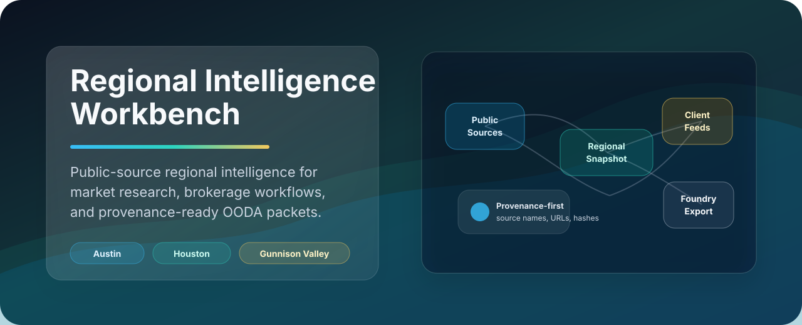
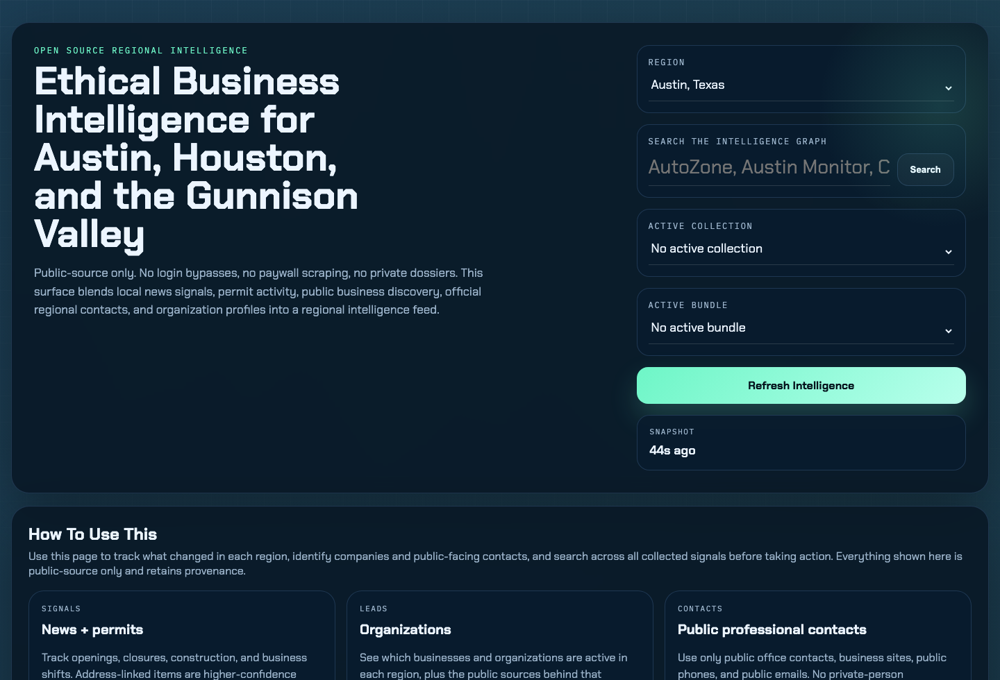
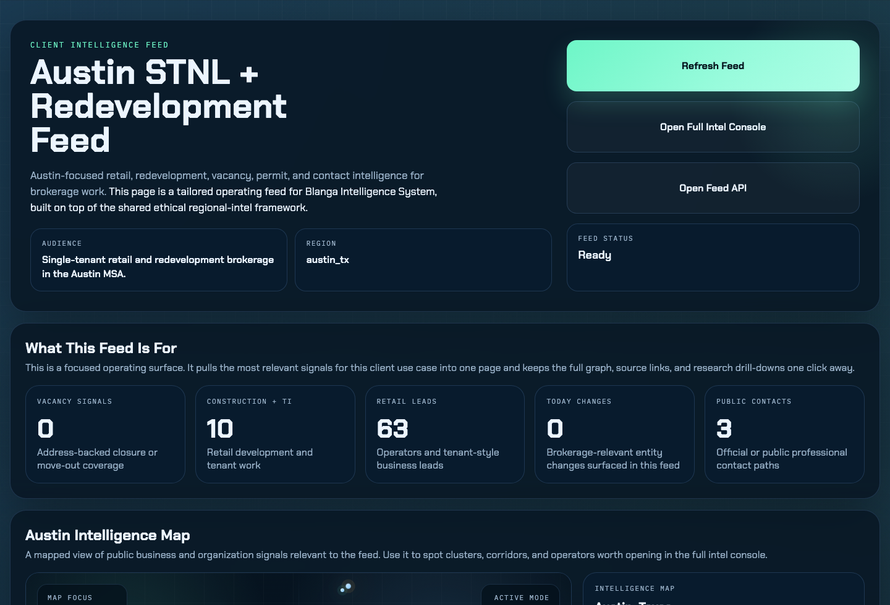

# Regional Intelligence Workbench Showcase

Regional Intelligence Workbench is a local-first public-source analyst console
for regional market signals, client-specific feeds, source health, and read-only
OODA packets. The demo story is simple: one shared intelligence graph can power
both a general analyst workspace and a polished client workflow while keeping
provenance visible.

This guide is written for a laptop demo. It does not imply a hosted production
deployment.

## Demo Assets

Use the committed assets when you need a quick preview in a README, deck, or
chat thread:







## Local Prep

From the repo root:

```bash
cd /Users/aribs/Code/regional-intel-workbench
source .venv/bin/activate
regional-intel serve --port 8768
```

If the editable package is not installed yet:

```bash
python -m venv .venv
source .venv/bin/activate
pip install -e .
python -m playwright install chromium
```

Open these tabs before the conversation starts:

| Surface | URL | What to show |
| --- | --- | --- |
| Shared console | `http://127.0.0.1:8768/intel` | search, graph, opportunities, source diagnostics, watchlists, collections, and briefs |
| Blanga Austin feed | `http://127.0.0.1:8768/blanga/austin` | client-specific deal radar, vacancy signals, commercial permits, operator discovery, and source context |
| Client API | `http://127.0.0.1:8768/api/client-views/blanga_austin` | JSON shape for a client feed built from the shared graph |
| Recent API | `http://127.0.0.1:8768/api/intel/recent?limit=10&region=austin_tx` | compact external-dashboard feed with source provenance and deep links |
| Legacy surface | `http://127.0.0.1:8768/vote-monitor` | backwards-compatible vote-monitor UI, if historical context matters |

## Three-Minute Script

1. Start with `/intel`.
   Show that the workbench is a shared regional intelligence console, not a
   one-off scraped page. Point to region filters, search, graph exploration,
   source diagnostics, saved watchlists, collections, and briefing flows.

2. Switch to `/blanga/austin`.
   Explain that this is the same intelligence graph shaped into an Austin STNL
   and redevelopment workflow. The feed highlights vacancy and closure signals,
   commercial permit context, redevelopment watch items, operator leads, and
   public contact paths.

3. Open `/api/client-views/blanga_austin`.
   Show that the polished client view is also available as structured JSON:
   metrics, sections, scored items, public source URLs, recommended human-review
   actions, and deep links back into `/intel`.

4. Close with the read-only OODA path.
   Run or describe:

   ```bash
   regional-intel intel-ooda-packet --region austin_tx --json
   ```

   The important point is the boundary: OODA packets are recommendations from
   stored snapshots. They do not refresh sources, write to Foundry/GCS/BigQuery,
   send messages, or trigger outreach.

## Strongest Talking Points

- Public-source-only collection model with no login-gated scraping or paywall
  bypass.
- Source names, source URLs, and source-health rows remain visible beside the
  intelligence product.
- Austin, Houston, and Gunnison / Crested Butte live in one snapshot model.
- Client-specific feeds sit on top of the shared graph instead of forking the
  collector.
- Foundry-ready NDJSON export is local and includes row hashes, file hashes,
  provenance drop counts, and source-health summary.
- OODA packets are read-only and use the latest stored regional snapshot.
- Source failures are explainable through source-health, source-history, and
  source-incident views rather than hidden from the operator.

## API And Client Views

High-signal local endpoints:

```text
GET /api/intel/health
GET /api/intel/regions
GET /api/intel/sources
GET /api/intel/snapshot
GET /api/intel/recent?limit=10&region=austin_tx
GET /api/intel/search?q=redevelopment&region=austin_tx
GET /api/intel/graph?region=austin_tx
GET /api/intel/opportunities?region=austin_tx
GET /api/intel/source-health?region=austin_tx
GET /api/intel/source-history?region=austin_tx
GET /api/intel/region-briefing/austin_tx
GET /api/intel/ooda-packet?region=austin_tx
GET /api/client-views
GET /api/client-views/blanga_austin
```

The client-view API is the cleanest proof that this is more than a static
dashboard. It returns a structured client workflow with metrics, sections,
scored feed items, source URLs, recommended next steps for human review, and
deep links back into the shared intelligence console.

## CLI Snippets

Use read paths by default during a demo:

```bash
regional-intel intel-snapshot --region austin_tx
regional-intel intel-search "redevelopment" --region austin_tx
regional-intel intel-opportunities --region houston_tx
regional-intel intel-region-briefing --region austin_tx
regional-intel intel-monitor-rules --region austin_tx
regional-intel intel-ooda-packet --region austin_tx --json
```

Use exports only when the audience specifically asks about downstream data
handoff:

```bash
regional-intel intel-foundry-export --region austin_tx --output-dir data/foundry/regional-intel
```

Add `--refresh` only when you intentionally want to discuss live public-source
collection. The cleaner friend-demo path uses stored local snapshots.

## Provenance And Ethics

This product should remain safe to show because it is intentionally
constrained:

- no login-gated scraping,
- no paywall bypass,
- no private-person dossiering,
- public professional and business contacts only,
- source names and source URLs kept with surfaced signals,
- source-health degradation shown to the operator,
- human review before action,
- no external writes from OODA packet generation.

The right demo language is "decision support from public regional signals." Do
not frame the workbench as automated targeting, surveillance, or a deployed
production system.

## Friend-Demo Checklist

Before the demo:

- Confirm the worktree is clean or know exactly what changed.
- Start the server locally on `127.0.0.1:8768`.
- Preload `/intel`, `/blanga/austin`, and `/api/client-views/blanga_austin`.
- Keep the committed screenshots handy if Wi-Fi or live source freshness becomes
  a distraction.
- Say that the local demo uses public-source sample history and current local
  app code.

During the demo:

- Show one source URL or source-health row before discussing recommendations.
- Use Austin first; it is the most polished client-feed story.
- Keep the legacy `/vote-monitor` surface as historical context, not the main
  product narrative.
- Avoid live external refreshes unless the audience asks about adapters.
- Do not add secrets, private customer data, login-gated sources, or real
  outreach actions.

After the demo:

- Offer the README and this showcase file as the follow-up artifact.
- If a fresh screenshot is needed, recapture only public-source, demo-safe UI
  states and preserve the existing assets unless there is a deliberate refresh.
